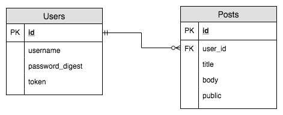

# Express User Authentication Example

This app demonstrates how to build out a simple user authentication system in express.

See the `completed` branch for the completed code.

## Running the example

1.  Clone this repo to your local machine.
2.  `cd` into the folder.
3.  Run `npm install`, this will install the dependencies for the module
4.  Run `npm run start:dev` to start the server
5.  Navigate to `http://localhost:3000`

## Database Design

We only have two models in this app, `Users` and `Posts`.

### `Users`

The `Users` table stores all the information related to the users of our app. It contains 4 columns:

* `id`: Unique identifier for the database
* `username`: The users username
* `password_digest`: The hashed version of our password
* `token`: A `uuid` to store in a cookie

### `Posts`

The `Posts` table stores some blog posts made by users. It contains 5 columns:

* `id`: Unique identifier for the database
* `user_id`: Foreign Key to the users table, this is the author of the post.
* `title`: The title of the blog post
* `body`: The body of the blog post
* `public`: Whether or not the post is publicly visible.

## Important Files

### [`/models`](models)

This folder contains our "domain models" for our application. In these files, we create functions which define the various operations that can be performed one each of our resources.

#### [`/models/User.js`](models/User.js)

This file defines the various actions we can perform on users, such as `register` and `login`.

#### [`/models/Post.js`](models/Post.js)

This file defines the various actions we can perform on posts, such as creating a new Post, finding posts and getting posts.

### [`index.js`](index.js)

This file is the entrypoint of our application, it pulls in all the dependencies and also contains the routes for `login`, `register` and `logout`.

### [`/views`](views)

This folder contains all of our `ejs` templates.

#### [`/views/partials`](views/partials)

This folder contains all the shared view partials, including the navbar and flash messages.

## Dependencies

* [`bcrypt`](https://www.npmjs.com/package/bcrypt)
* [`express.js`](https://expressjs.com/)
* [`knex.js`](http://knexjs.org/#Schema-alter)
